# State Machine Diagrams

This document provides comprehensive state machine diagrams for all stateful components in the Prediction Analyzer application.

## Table of Contents

1. [GUI Application State Machine](#1-gui-application-state-machine)
2. [Authentication Flow State Machine](#2-authentication-flow-state-machine)
3. [Data Fetching/Pagination State Machine](#3-data-fetchingpagination-state-machine)
4. [Filter Pipeline State Machine](#4-filter-pipeline-state-machine)
5. [PnL Calculation State Machine](#5-pnl-calculation-state-machine)
6. [Interactive CLI State Machine](#6-interactive-cli-state-machine)
7. [Chart Generation State Machine](#7-chart-generation-state-machine)
8. [Market Resolution Inference State Machine](#8-market-resolution-inference-state-machine)
9. [Export State Machine](#9-export-state-machine)

---

## 1. GUI Application State Machine

**File:** `gui.py`

The main GUI application manages the overall application state including data loading, filtering, and display.

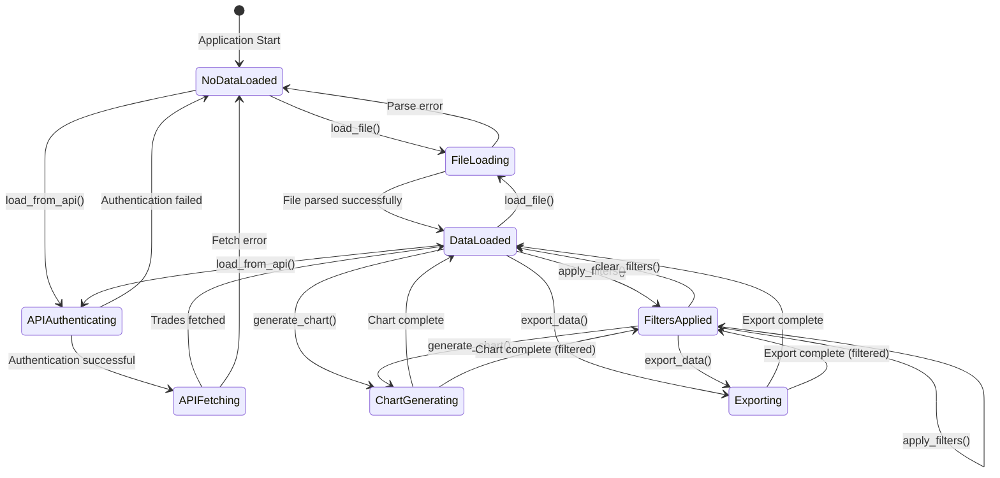

### GUI State Variables

| Variable | Type | Description |
|----------|------|-------------|
| `all_trades` | `List[Trade]` | Complete trade dataset |
| `filtered_trades` | `List[Trade]` | Currently filtered subset |
| `current_file_path` | `Optional[str]` | Source file path (None for API) |
| `market_slugs` | `List[str]` | Available markets from filtered data |
| `buy_var` | `BooleanVar` | Buy filter checkbox state |
| `sell_var` | `BooleanVar` | Sell filter checkbox state |

---

## 2. Authentication Flow State Machine

**File:** `prediction_analyzer/utils/auth.py`

Handles API authentication using Ethereum private key signing.

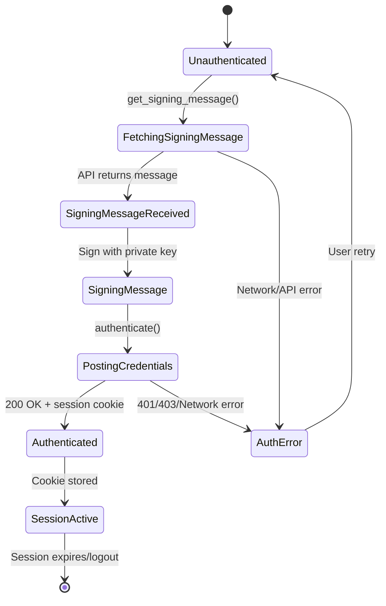

### Authentication State Outputs

| State | Output |
|-------|--------|
| `Unauthenticated` | No session |
| `Authenticated` | `(session_cookie, address)` tuple |
| `AuthError` | `(None, None)` tuple |

---

## 3. Data Fetching/Pagination State Machine

**File:** `prediction_analyzer/utils/data.py`

Manages paginated API data fetching with accumulation.

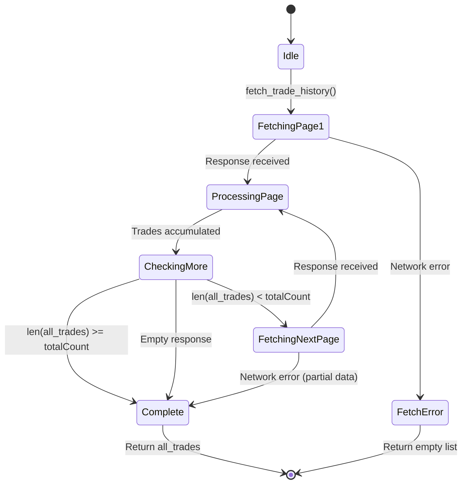

### Pagination State Variables

| Variable | Type | Description |
|----------|------|-------------|
| `all_trades` | `List[dict]` | Accumulating trades |
| `page` | `int` | Current page number |
| `total_count` | `int` | Total available from API |

---

## 4. Filter Pipeline State Machine

**File:** `prediction_analyzer/filters.py`

Sequential filter application with validation.

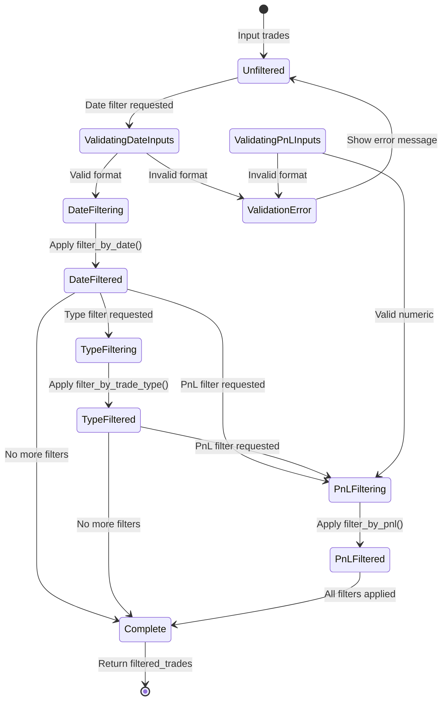

### Filter Functions (Pure State Transformers)

```
Input State: List[Trade]
    │
    ├── filter_by_date(start, end)     → List[Trade]
    │
    ├── filter_by_trade_type(types)    → List[Trade]
    │
    ├── filter_by_side(sides)          → List[Trade]
    │
    └── filter_by_pnl(min, max)        → List[Trade]

Output State: List[Trade] (subset)
```

---

## 5. PnL Calculation State Machine

**File:** `prediction_analyzer/pnl.py`

Cumulative PnL calculation with running totals.

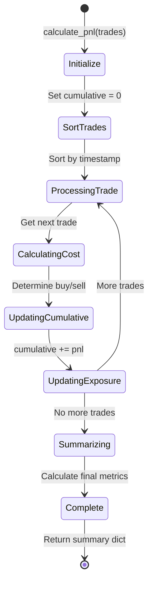

### PnL State Accumulation

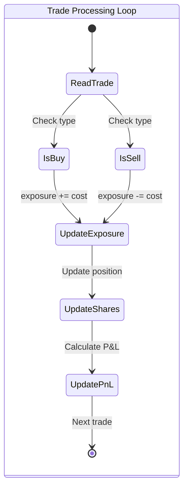

### Summary State Output

| Metric | Calculation |
|--------|-------------|
| `total_pnl` | Sum of all trade PnLs |
| `winning_trades` | Count where pnl > 0 |
| `losing_trades` | Count where pnl < 0 |
| `win_rate` | winning / total * 100 |
| `roi` | total_pnl / total_invested * 100 |

---

## 6. Interactive CLI State Machine

**File:** `prediction_analyzer/core/interactive.py`

Menu-driven CLI navigation system.

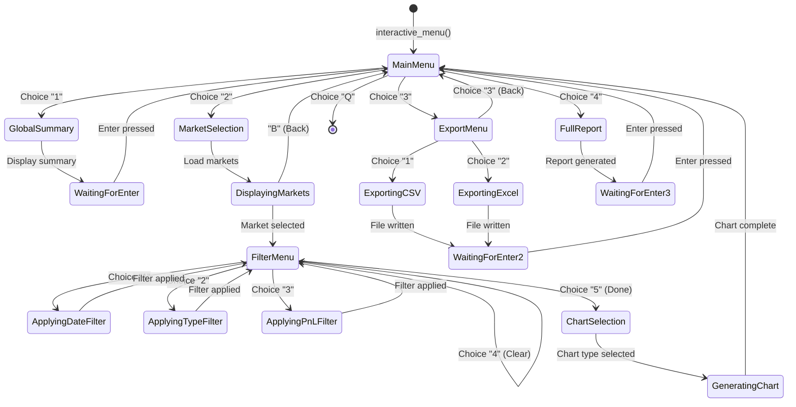

### Menu State Hierarchy

```
MainMenu
├── [1] GlobalSummary → Display → Return
├── [2] MarketSelection
│   └── FilterMenu
│       ├── [1] DateFilter → Apply → Return to FilterMenu
│       ├── [2] TypeFilter → Apply → Return to FilterMenu
│       ├── [3] PnLFilter → Apply → Return to FilterMenu
│       ├── [4] ClearFilters → Return to FilterMenu
│       └── [5] Done → ChartSelection → Generate → Return to Main
├── [3] ExportMenu
│   ├── [1] CSV Export → Write → Return
│   ├── [2] Excel Export → Write → Return
│   └── [3] Back → Return to Main
├── [4] FullReport → Generate → Return
└── [Q] Quit → Exit
```

---

## 7. Chart Generation State Machine

**Files:** `prediction_analyzer/charts/*.py`

Stateful chart generation with cumulative calculations.

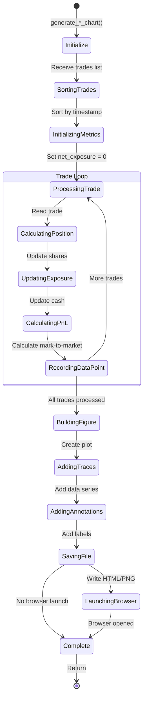

### Chart Type State Variants

| Chart Type | File | Key State Variables |
|------------|------|---------------------|
| Simple | `simple.py` | `net_exposure`, `exposures[]`, `final_pnl` |
| Pro | `pro.py` | `cumulative_pnl`, `net_exposure`, `colors[]` |
| Enhanced | `enhanced.py` | `current_shares`, `current_cost`, `running_pnl` |
| Dashboard | `global_chart.py` | `per_market_pnl`, `total_portfolio_pnl` |

---

## 8. Market Resolution Inference State Machine

**File:** `prediction_analyzer/inference.py`

Determines market outcome from trade patterns.

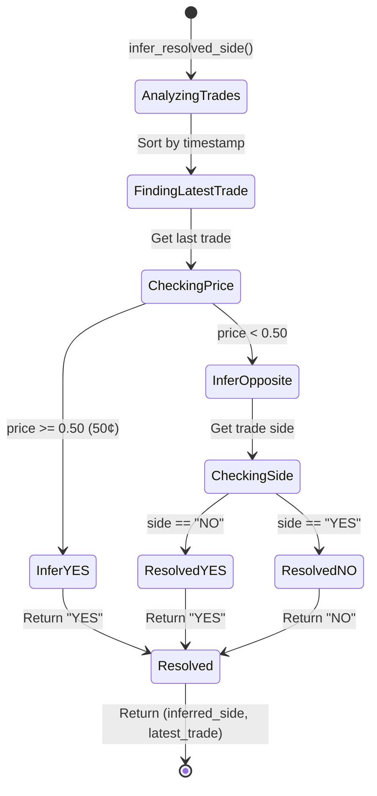

### Inference Logic

```
IF latest_price >= $0.50:
    inferred_outcome = "YES"  # High price = market resolved YES
ELSE:
    IF latest_side == "YES":
        inferred_outcome = "NO"   # Bought YES cheap = market went NO
    ELSE:
        inferred_outcome = "YES"  # Bought NO cheap = market went YES
```

---

## 9. Export State Machine

**File:** `prediction_analyzer/reporting/report_data.py`

File export workflow with format selection.

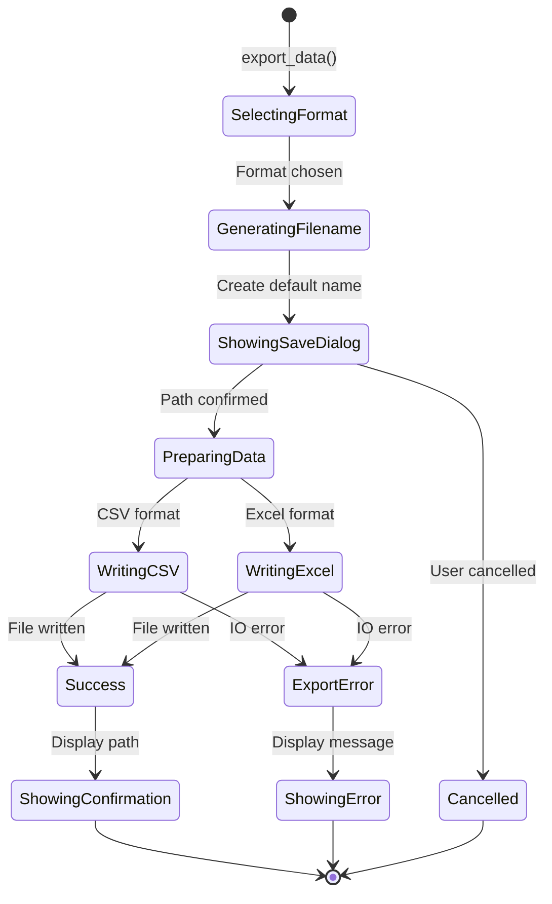

---

## Component State Summary

| Component | State Type | Persistence | Side Effects |
|-----------|-----------|-------------|--------------|
| GUI | Class instance | Session | UI updates, file I/O |
| Auth | Transient | HTTP cookie | Network requests |
| Data Fetch | Transient | None | Network requests |
| Filters | Pure functional | None | None |
| PnL | Transient | None | Calculations only |
| Interactive CLI | Loop-based | Session | Console I/O |
| Charts | Transient | File output | File I/O, browser |
| Inference | Pure functional | None | None |
| Export | Transient | File output | File I/O |

---

## State Flow Overview

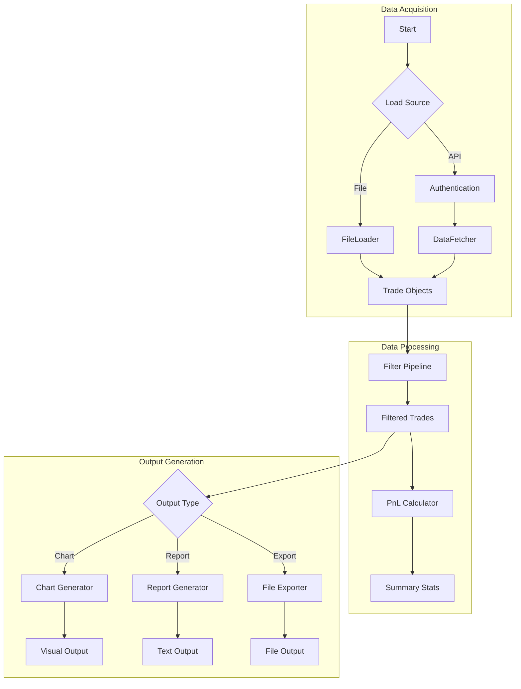

---

## Appendix: State Transition Triggers

### User Actions
| Trigger | Component | Transition |
|---------|-----------|------------|
| Click "Load File" | GUI | NoDataLoaded → FileLoading |
| Click "Load from API" | GUI | NoDataLoaded → APIAuthenticating |
| Click "Apply Filters" | GUI | DataLoaded → FiltersApplied |
| Click "Clear Filters" | GUI | FiltersApplied → DataLoaded |
| Select menu option | CLI | CurrentMenu → SelectedSubmenu |

### System Events
| Event | Component | Transition |
|-------|-----------|------------|
| HTTP 200 response | Auth | PostingCredentials → Authenticated |
| HTTP error | Auth | PostingCredentials → AuthError |
| Last page fetched | DataFetch | CheckingMore → Complete |
| File write success | Export | WritingFile → Success |

### Data Events
| Event | Component | Transition |
|-------|-----------|------------|
| Trade processed | PnL | ProcessingTrade → UpdatingCumulative |
| All trades done | Chart | RecordingDataPoint → BuildingFigure |
| Filter applied | Filter | Input → Output (pure transform) |
