# State Machine Diagrams

This document provides comprehensive state machine diagrams for all stateful components in the Prediction Analyzer application.

## Table of Contents

1. [GUI Application State Machine](#1-gui-application-state-machine)
2. [Provider Selection State Machine](#2-provider-selection-state-machine)
3. [Authentication Flow State Machine](#3-authentication-flow-state-machine)
4. [Data Fetching/Pagination State Machine](#4-data-fetchingpagination-state-machine)
5. [Filter Pipeline State Machine](#5-filter-pipeline-state-machine)
6. [PnL Calculation State Machine](#6-pnl-calculation-state-machine)
7. [Interactive CLI State Machine](#7-interactive-cli-state-machine)
8. [Chart Generation State Machine](#8-chart-generation-state-machine)
9. [Market Resolution Inference State Machine](#9-market-resolution-inference-state-machine)
10. [Export State Machine](#10-export-state-machine)
11. [MCP Session State Machine](#11-mcp-session-state-machine)
12. [FIFO PnL Calculator State Machine](#12-fifo-pnl-calculator-state-machine)

---

## 1. GUI Application State Machine

**File:** `gui.py`

The main GUI application manages the overall application state including provider selection, data loading, filtering, and display.

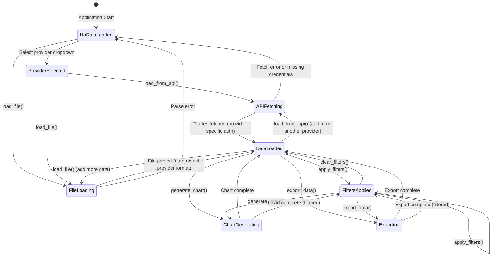
```mermaid
stateDiagram-v2
    [*] --> NoDataLoaded: Application Start

    NoDataLoaded --> ProviderSelected: Select provider dropdown
    NoDataLoaded --> FileLoading: load_file()

    ProviderSelected --> APIFetching: load_from_api()
    ProviderSelected --> FileLoading: load_file()

    FileLoading --> DataLoaded: File parsed (auto-detect provider format)
    FileLoading --> NoDataLoaded: Parse error

    APIFetching --> DataLoaded: Trades fetched (provider-specific auth)
    APIFetching --> NoDataLoaded: Fetch error or missing credentials

    DataLoaded --> FiltersApplied: apply_filters()
    DataLoaded --> ChartGenerating: generate_chart()
    DataLoaded --> Exporting: export_data()
    DataLoaded --> FileLoading: load_file() (add more data)
    DataLoaded --> APIFetching: load_from_api() (add from another provider)

    FiltersApplied --> DataLoaded: clear_filters()
    FiltersApplied --> FiltersApplied: apply_filters()
    FiltersApplied --> ChartGenerating: generate_chart()
    FiltersApplied --> Exporting: export_data()

    ChartGenerating --> DataLoaded: Chart complete
    ChartGenerating --> FiltersApplied: Chart complete (filtered)

    Exporting --> DataLoaded: Export complete
    Exporting --> FiltersApplied: Export complete (filtered)
```

### GUI State Variables

| Variable | Type | Description |
|----------|------|-------------|
| `all_trades` | `List[Trade]` | Complete trade dataset (may span providers) |
| `filtered_trades` | `List[Trade]` | Currently filtered subset |
| `current_file_path` | `Optional[str]` | Source file path (None for API) |
| `market_slugs` | `List[str]` | Available markets from filtered data |
| `provider_var` | `StringVar` | Selected provider (auto/limitless/polymarket/kalshi/manifold) |
| `buy_var` | `BooleanVar` | Buy filter checkbox state |
| `sell_var` | `BooleanVar` | Sell filter checkbox state |

---

## 2. Provider Selection State Machine

**Files:** `prediction_analyzer/providers/base.py`, `prediction_analyzer/utils/auth.py`

Handles provider resolution from API key format, explicit selection, or file auto-detection.

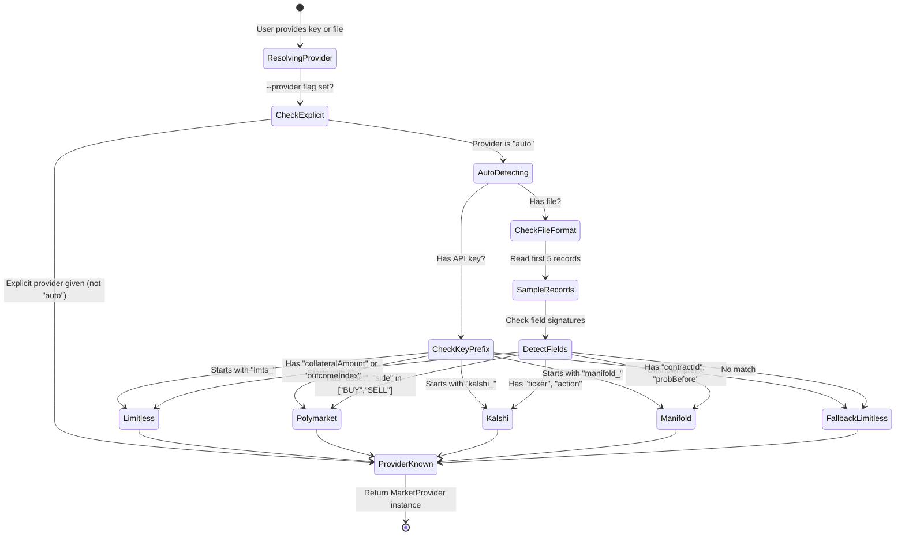
```mermaid
stateDiagram-v2
    [*] --> ResolvingProvider: User provides key or file

    ResolvingProvider --> CheckExplicit: --provider flag set?

    CheckExplicit --> ProviderKnown: Explicit provider given (not "auto")
    CheckExplicit --> AutoDetecting: Provider is "auto"

    AutoDetecting --> CheckKeyPrefix: Has API key?
    AutoDetecting --> CheckFileFormat: Has file?

    CheckKeyPrefix --> Limitless: Starts with "lmts_"
    CheckKeyPrefix --> Polymarket: Starts with "0x"
    CheckKeyPrefix --> Kalshi: Starts with "kalshi_"
    CheckKeyPrefix --> Manifold: Starts with "manifold_"
    CheckKeyPrefix --> FallbackLimitless: Unknown prefix

    CheckFileFormat --> SampleRecords: Read first 5 records
    SampleRecords --> DetectFields: Check field signatures

    DetectFields --> Polymarket: Has "asset", "side" in ["BUY","SELL"]
    DetectFields --> Kalshi: Has "ticker", "action"
    DetectFields --> Manifold: Has "contractId", "probBefore"
    DetectFields --> Limitless: Has "collateralAmount" or "outcomeIndex"
    DetectFields --> FallbackLimitless: No match

    Limitless --> ProviderKnown
    Polymarket --> ProviderKnown
    Kalshi --> ProviderKnown
    Manifold --> ProviderKnown
    FallbackLimitless --> ProviderKnown

    ProviderKnown --> [*]: Return MarketProvider instance
```

### Provider Registry

| Provider | Key Prefix | Detection Fields | Currency |
|----------|-----------|-----------------|----------|
| Limitless | `lmts_` | `collateralAmount`, `outcomeIndex` | USDC |
| Polymarket | `0x` | `asset`, `side` in BUY/SELL | USDC |
| Kalshi | `kalshi_` | `ticker`, `action` | USD |
| Manifold | `manifold_` | `contractId`, `probBefore` | MANA |

---

## 3. Authentication Flow State Machine

**File:** `prediction_analyzer/utils/auth.py`

Handles multi-provider API key resolution.

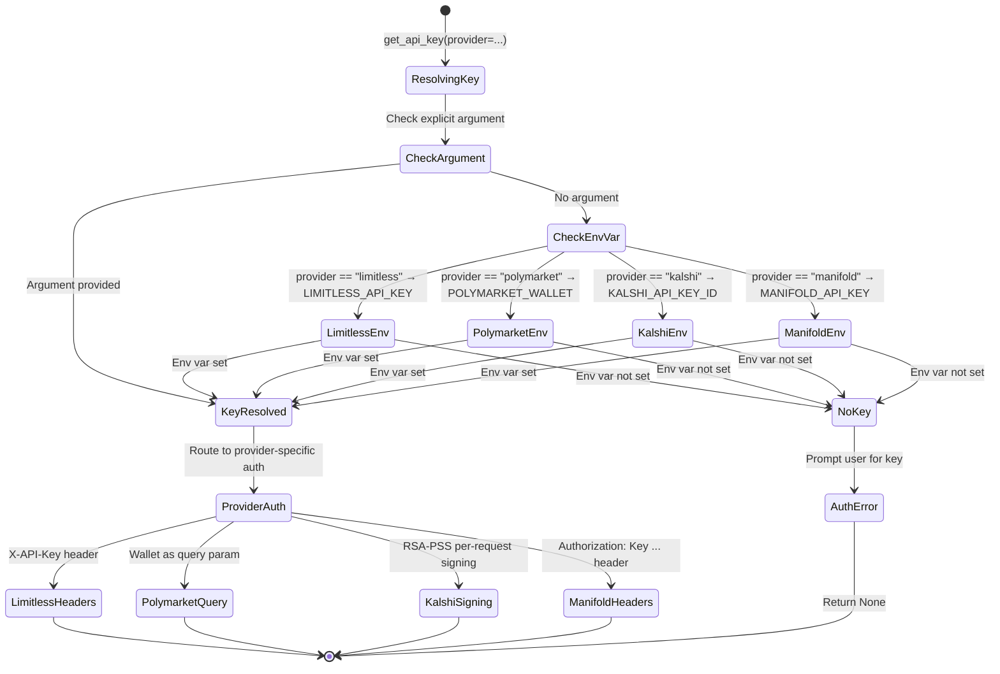
```mermaid
stateDiagram-v2
    [*] --> ResolvingKey: get_api_key(provider=...)

    ResolvingKey --> CheckArgument: Check explicit argument

    CheckArgument --> KeyResolved: Argument provided
    CheckArgument --> CheckEnvVar: No argument

    CheckEnvVar --> LimitlessEnv: provider == "limitless" → LIMITLESS_API_KEY
    CheckEnvVar --> PolymarketEnv: provider == "polymarket" → POLYMARKET_WALLET
    CheckEnvVar --> KalshiEnv: provider == "kalshi" → KALSHI_API_KEY_ID
    CheckEnvVar --> ManifoldEnv: provider == "manifold" → MANIFOLD_API_KEY

    LimitlessEnv --> KeyResolved: Env var set
    LimitlessEnv --> NoKey: Env var not set
    PolymarketEnv --> KeyResolved: Env var set
    PolymarketEnv --> NoKey: Env var not set
    KalshiEnv --> KeyResolved: Env var set
    KalshiEnv --> NoKey: Env var not set
    ManifoldEnv --> KeyResolved: Env var set
    ManifoldEnv --> NoKey: Env var not set

    KeyResolved --> ProviderAuth: Route to provider-specific auth
    NoKey --> AuthError: Prompt user for key

    ProviderAuth --> LimitlessHeaders: X-API-Key header
    ProviderAuth --> PolymarketQuery: Wallet as query param
    ProviderAuth --> KalshiSigning: RSA-PSS per-request signing
    ProviderAuth --> ManifoldHeaders: Authorization: Key ... header

    LimitlessHeaders --> [*]
    PolymarketQuery --> [*]
    KalshiSigning --> [*]
    ManifoldHeaders --> [*]
    AuthError --> [*]: Return None
```

### Authentication Methods by Provider

| Provider | Auth Method | Header/Param |
|----------|------------|--------------|
| Limitless | API key | `X-API-Key: lmts_...` |
| Polymarket | None (public) | `?maker_address=0x...` query param |
| Kalshi | RSA-PSS | Per-request signed `Authorization` header |
| Manifold | API key | `Authorization: Key manifold_...` |

---

## 4. Data Fetching/Pagination State Machine

**Files:** `prediction_analyzer/providers/*.py`

Each provider has its own pagination strategy.

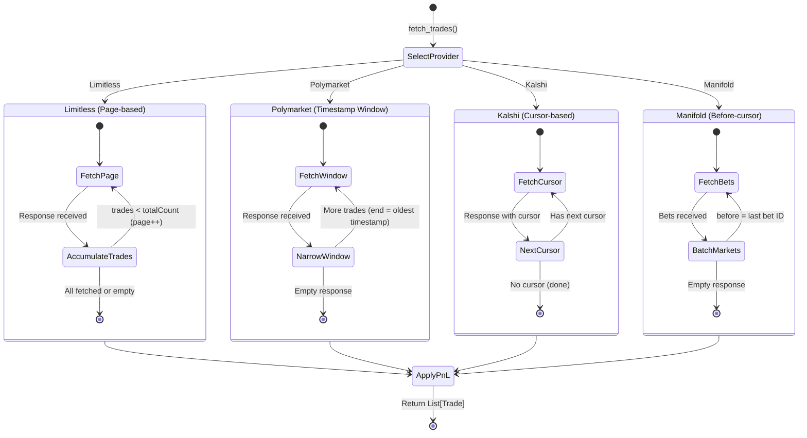
```mermaid
stateDiagram-v2
    [*] --> SelectProvider: fetch_trades()

    SelectProvider --> LimitlessPagination: Limitless
    SelectProvider --> PolymarketPagination: Polymarket
    SelectProvider --> KalshiPagination: Kalshi
    SelectProvider --> ManifoldPagination: Manifold

    state "Limitless (Page-based)" as LimitlessPagination {
        [*] --> FetchPage
        FetchPage --> AccumulateTrades: Response received
        AccumulateTrades --> FetchPage: trades < totalCount (page++)
        AccumulateTrades --> [*]: All fetched or empty
    }

    state "Polymarket (Timestamp Window)" as PolymarketPagination {
        [*] --> FetchWindow
        FetchWindow --> NarrowWindow: Response received
        NarrowWindow --> FetchWindow: More trades (end = oldest timestamp)
        NarrowWindow --> [*]: Empty response
    }

    state "Kalshi (Cursor-based)" as KalshiPagination {
        [*] --> FetchCursor
        FetchCursor --> NextCursor: Response with cursor
        NextCursor --> FetchCursor: Has next cursor
        NextCursor --> [*]: No cursor (done)
    }

    state "Manifold (Before-cursor)" as ManifoldPagination {
        [*] --> FetchBets
        FetchBets --> BatchMarkets: Bets received
        BatchMarkets --> FetchBets: before = last bet ID
        BatchMarkets --> [*]: Empty response
    }

    LimitlessPagination --> ApplyPnL
    PolymarketPagination --> ApplyPnL
    KalshiPagination --> ApplyPnL
    ManifoldPagination --> ApplyPnL

    ApplyPnL --> [*]: Return List[Trade]
```

### Pagination Parameters

| Provider | Strategy | Param | Notes |
|----------|---------|-------|-------|
| Limitless | Page number | `page=N` | Uses totalCount to know when done |
| Polymarket | Timestamp window | `end=timestamp` | Narrows end to oldest seen |
| Kalshi | Cursor | `cursor=token` | Server returns next cursor |
| Manifold | Before ID | `before=betId` | Uses last bet ID as cursor |

---

## 5. Filter Pipeline State Machine

**File:** `prediction_analyzer/filters.py`, `prediction_analyzer/trade_filter.py`

Sequential filter application with validation. Now includes source filtering.

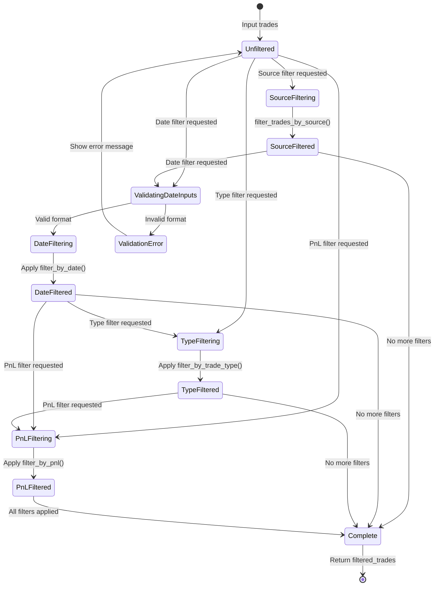
```mermaid
stateDiagram-v2
    [*] --> Unfiltered: Input trades

    Unfiltered --> SourceFiltering: Source filter requested
    Unfiltered --> ValidatingDateInputs: Date filter requested
    Unfiltered --> TypeFiltering: Type filter requested
    Unfiltered --> PnLFiltering: PnL filter requested

    SourceFiltering --> SourceFiltered: filter_trades_by_source()

    SourceFiltered --> ValidatingDateInputs: Date filter requested
    SourceFiltered --> Complete: No more filters

    ValidatingDateInputs --> DateFiltering: Valid format
    ValidatingDateInputs --> ValidationError: Invalid format

    DateFiltering --> DateFiltered: Apply filter_by_date()

    DateFiltered --> TypeFiltering: Type filter requested
    DateFiltered --> PnLFiltering: PnL filter requested
    DateFiltered --> Complete: No more filters

    TypeFiltering --> TypeFiltered: Apply filter_by_trade_type()

    TypeFiltered --> PnLFiltering: PnL filter requested
    TypeFiltered --> Complete: No more filters

    PnLFiltering --> PnLFiltered: Apply filter_by_pnl()

    PnLFiltered --> Complete: All filters applied

    ValidationError --> Unfiltered: Show error message

    Complete --> [*]: Return filtered_trades
```

### Filter Functions (Pure State Transformers)

```
Input State: List[Trade]
    │
    ├── filter_trades_by_source(source)  → List[Trade]
    │
    ├── filter_by_date(start, end)       → List[Trade]
    │
    ├── filter_by_trade_type(types)      → List[Trade]
    │
    ├── filter_by_side(sides)            → List[Trade]
    │
    └── filter_by_pnl(min, max)          → List[Trade]

Output State: List[Trade] (subset)
```

---

## 6. PnL Calculation State Machine

**File:** `prediction_analyzer/pnl.py`

Cumulative PnL calculation with running totals and optional per-source breakdown.

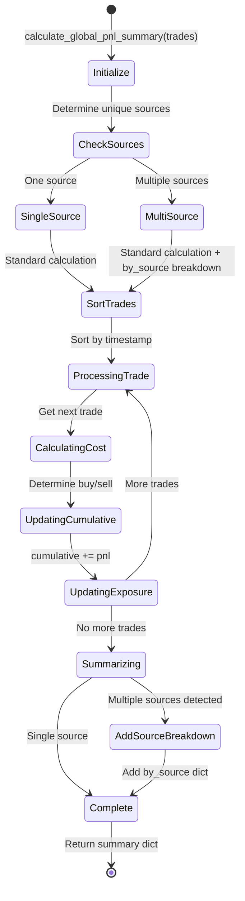
```mermaid
stateDiagram-v2
    [*] --> Initialize: calculate_global_pnl_summary(trades)

    Initialize --> CheckSources: Determine unique sources

    CheckSources --> SingleSource: One source
    CheckSources --> MultiSource: Multiple sources

    SingleSource --> SortTrades: Standard calculation
    MultiSource --> SortTrades: Standard calculation + by_source breakdown

    SortTrades --> ProcessingTrade: Sort by timestamp

    ProcessingTrade --> CalculatingCost: Get next trade

    CalculatingCost --> UpdatingCumulative: Determine buy/sell

    UpdatingCumulative --> UpdatingExposure: cumulative += pnl

    UpdatingExposure --> ProcessingTrade: More trades
    UpdatingExposure --> Summarizing: No more trades

    Summarizing --> AddSourceBreakdown: Multiple sources detected
    Summarizing --> Complete: Single source

    AddSourceBreakdown --> Complete: Add by_source dict

    Complete --> [*]: Return summary dict
```

### Summary State Output

| Metric | Calculation |
|--------|-------------|
| `total_pnl` | Sum of all trade PnLs |
| `winning_trades` | Count where pnl > 0 |
| `losing_trades` | Count where pnl < 0 |
| `win_rate` | winning / total * 100 |
| `roi` | total_pnl / total_invested * 100 |
| `by_source` | Per-provider breakdown (when multi-source) |

---

## 7. Interactive CLI State Machine

**File:** `prediction_analyzer/core/interactive.py`

Menu-driven CLI navigation system.

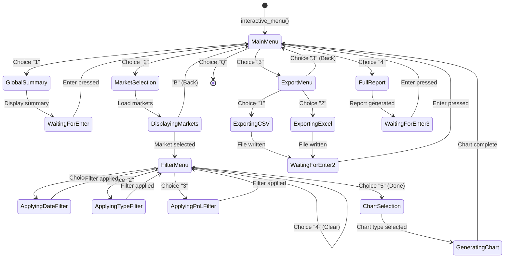
```mermaid
stateDiagram-v2
    [*] --> MainMenu: interactive_menu()

    MainMenu --> GlobalSummary: Choice "1"
    MainMenu --> MarketSelection: Choice "2"
    MainMenu --> ExportMenu: Choice "3"
    MainMenu --> FullReport: Choice "4"
    MainMenu --> [*]: Choice "Q"

    GlobalSummary --> WaitingForEnter: Display summary
    WaitingForEnter --> MainMenu: Enter pressed

    MarketSelection --> DisplayingMarkets: Load markets
    DisplayingMarkets --> FilterMenu: Market selected
    DisplayingMarkets --> MainMenu: "B" (Back)

    FilterMenu --> ApplyingDateFilter: Choice "1"
    FilterMenu --> ApplyingTypeFilter: Choice "2"
    FilterMenu --> ApplyingPnLFilter: Choice "3"
    FilterMenu --> FilterMenu: Choice "4" (Clear)
    FilterMenu --> ChartSelection: Choice "5" (Done)

    ApplyingDateFilter --> FilterMenu: Filter applied
    ApplyingTypeFilter --> FilterMenu: Filter applied
    ApplyingPnLFilter --> FilterMenu: Filter applied

    ChartSelection --> GeneratingChart: Chart type selected
    GeneratingChart --> MainMenu: Chart complete

    ExportMenu --> ExportingCSV: Choice "1"
    ExportMenu --> ExportingExcel: Choice "2"
    ExportMenu --> MainMenu: Choice "3" (Back)

    ExportingCSV --> WaitingForEnter2: File written
    ExportingExcel --> WaitingForEnter2: File written
    WaitingForEnter2 --> MainMenu: Enter pressed

    FullReport --> WaitingForEnter3: Report generated
    WaitingForEnter3 --> MainMenu: Enter pressed
```

---

## 8. Chart Generation State Machine

**Files:** `prediction_analyzer/charts/*.py`

Stateful chart generation with cumulative calculations.

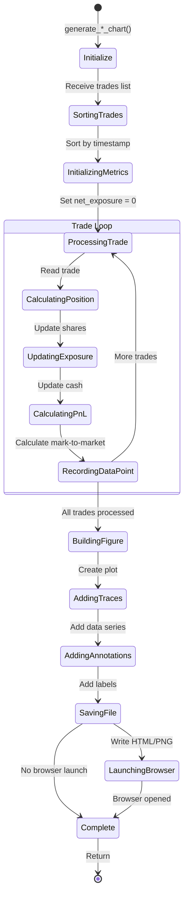
```mermaid
stateDiagram-v2
    [*] --> Initialize: generate_*_chart()

    Initialize --> SortingTrades: Receive trades list

    SortingTrades --> InitializingMetrics: Sort by timestamp

    InitializingMetrics --> ProcessingTrade: Set net_exposure = 0

    state "Trade Loop" as loop {
        ProcessingTrade --> CalculatingPosition: Read trade
        CalculatingPosition --> UpdatingExposure: Update shares
        UpdatingExposure --> CalculatingPnL: Update cash
        CalculatingPnL --> RecordingDataPoint: Calculate mark-to-market
        RecordingDataPoint --> ProcessingTrade: More trades
    }

    RecordingDataPoint --> BuildingFigure: All trades processed

    BuildingFigure --> AddingTraces: Create plot
    AddingTraces --> AddingAnnotations: Add data series
    AddingAnnotations --> SavingFile: Add labels

    SavingFile --> LaunchingBrowser: Write HTML/PNG
    SavingFile --> Complete: No browser launch

    LaunchingBrowser --> Complete: Browser opened

    Complete --> [*]: Return
```

### Chart Type State Variants

| Chart Type | File | Key State Variables |
|------------|------|---------------------|
| Simple | `simple.py` | `net_exposure`, `exposures[]`, `final_pnl` |
| Pro | `pro.py` | `cumulative_pnl`, `net_exposure`, `colors[]` |
| Enhanced | `enhanced.py` | `current_shares`, `current_cost`, `running_pnl` |
| Dashboard | `global_chart.py` | `per_market_pnl`, `total_portfolio_pnl` |

---

## 9. Market Resolution Inference State Machine

**File:** `prediction_analyzer/inference.py`

Determines market outcome from trade patterns.

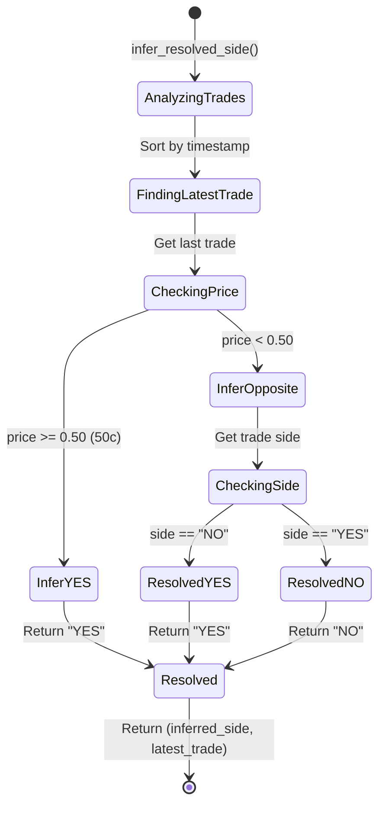
```mermaid
stateDiagram-v2
    [*] --> AnalyzingTrades: infer_resolved_side()

    AnalyzingTrades --> FindingLatestTrade: Sort by timestamp

    FindingLatestTrade --> CheckingPrice: Get last trade

    CheckingPrice --> InferYES: price >= 0.50 (50c)
    CheckingPrice --> InferOpposite: price < 0.50

    InferYES --> Resolved: Return "YES"

    InferOpposite --> CheckingSide: Get trade side
    CheckingSide --> ResolvedNO: side == "YES"
    CheckingSide --> ResolvedYES: side == "NO"

    ResolvedYES --> Resolved: Return "YES"
    ResolvedNO --> Resolved: Return "NO"

    Resolved --> [*]: Return (inferred_side, latest_trade)
```

---

## 10. Export State Machine

**File:** `prediction_analyzer/reporting/report_data.py`

File export workflow with format selection. Export now includes source and currency fields.

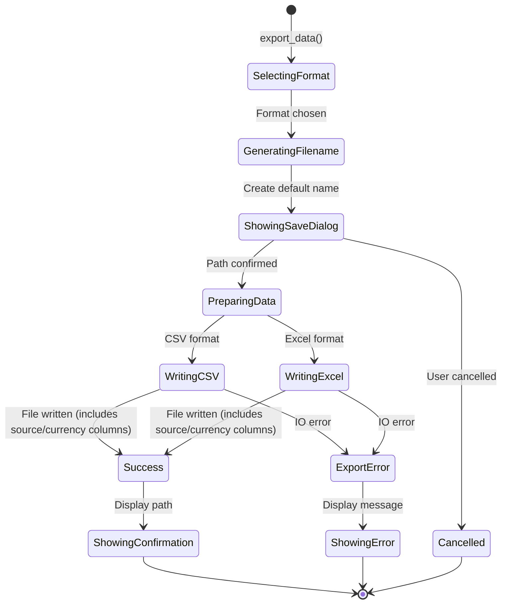
```mermaid
stateDiagram-v2
    [*] --> SelectingFormat: export_data()

    SelectingFormat --> GeneratingFilename: Format chosen

    GeneratingFilename --> ShowingSaveDialog: Create default name

    ShowingSaveDialog --> PreparingData: Path confirmed
    ShowingSaveDialog --> Cancelled: User cancelled

    PreparingData --> WritingCSV: CSV format
    PreparingData --> WritingExcel: Excel format

    WritingCSV --> Success: File written (includes source/currency columns)
    WritingCSV --> ExportError: IO error

    WritingExcel --> Success: File written (includes source/currency columns)
    WritingExcel --> ExportError: IO error

    Success --> ShowingConfirmation: Display path
    ExportError --> ShowingError: Display message

    ShowingConfirmation --> [*]
    ShowingError --> [*]
    Cancelled --> [*]
```

---

## 11. MCP Session State Machine

**File:** `prediction_mcp/state.py`, `prediction_mcp/persistence.py`

Multi-source session state with optional SQLite persistence.

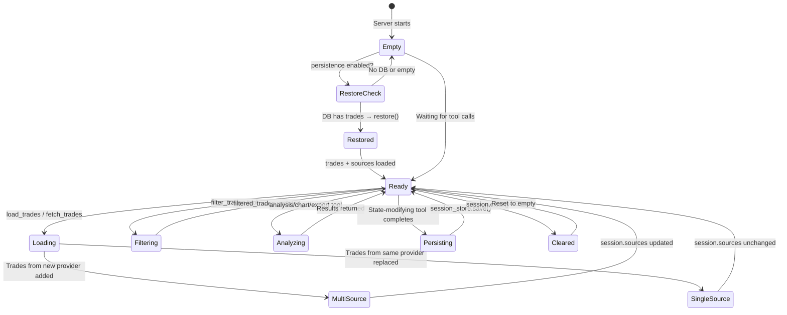
```mermaid
stateDiagram-v2
    [*] --> Empty: Server starts

    Empty --> RestoreCheck: persistence enabled?
    RestoreCheck --> Restored: DB has trades → restore()
    RestoreCheck --> Empty: No DB or empty

    Restored --> Ready: trades + sources loaded
    Empty --> Ready: Waiting for tool calls

    Ready --> Loading: load_trades / fetch_trades

    Loading --> MultiSource: Trades from new provider added
    Loading --> SingleSource: Trades from same provider replaced

    MultiSource --> Ready: session.sources updated
    SingleSource --> Ready: session.sources unchanged

    Ready --> Filtering: filter_trades tool
    Filtering --> Ready: filtered_trades updated

    Ready --> Analyzing: analysis/chart/export tool
    Analyzing --> Ready: Results returned

    Ready --> Persisting: State-modifying tool completes
    Persisting --> Ready: session_store.save()

    Ready --> Cleared: session.clear()
    Cleared --> Ready: Reset to empty
```

### MCP Session State Variables

| Variable | Type | Description |
|----------|------|-------------|
| `trades` | `List[Trade]` | All loaded trades (may span providers) |
| `filtered_trades` | `List[Trade]` | Currently filtered subset |
| `active_filters` | `Dict[str, Any]` | Applied filter parameters |
| `sources` | `List[str]` | Active provider sources (e.g. ["limitless", "polymarket"]) |

### Persistence Schema

| Table | Key Columns | Notes |
|-------|-------------|-------|
| `trades` | market, timestamp, price, shares, cost, type, side, pnl, source, currency | Full trade data |
| `session_meta` | key, value | Stores sources list and active_filters as JSON |

---

## 12. FIFO PnL Calculator State Machine

**File:** `prediction_analyzer/providers/pnl_calculator.py`

FIFO matching of buy/sell pairs for providers without native PnL (Polymarket, Manifold).

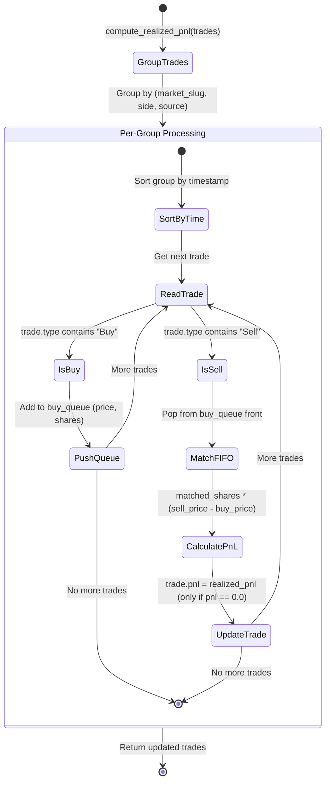
```mermaid
stateDiagram-v2
    [*] --> GroupTrades: compute_realized_pnl(trades)

    GroupTrades --> ProcessGroup: Group by (market_slug, side, source)

    state "Per-Group Processing" as ProcessGroup {
        [*] --> SortByTime: Sort group by timestamp

        SortByTime --> ReadTrade: Get next trade

        ReadTrade --> IsBuy: trade.type contains "Buy"
        ReadTrade --> IsSell: trade.type contains "Sell"

        IsBuy --> PushQueue: Add to buy_queue (price, shares)
        PushQueue --> ReadTrade: More trades
        PushQueue --> [*]: No more trades

        IsSell --> MatchFIFO: Pop from buy_queue front

        MatchFIFO --> CalculatePnL: matched_shares * (sell_price - buy_price)
        CalculatePnL --> UpdateTrade: trade.pnl = realized_pnl (only if pnl == 0.0)
        UpdateTrade --> ReadTrade: More trades
        UpdateTrade --> [*]: No more trades
    }

    ProcessGroup --> [*]: Return updated trades
```

### FIFO Matching Rules

- Trades grouped by `(market_slug, side, source)` key
- Within each group, sorted by timestamp
- Buy trades pushed to FIFO queue
- Sell trades matched against oldest buys first
- PnL only assigned to trades with `pnl == 0.0` (preserves existing PnL)

---

## Component State Summary

| Component | State Type | Persistence | Side Effects |
|-----------|-----------|-------------|--------------|
| GUI | Class instance | Session | UI updates, file I/O |
| Provider Selection | Transient | None | Registry lookup |
| Auth | Transient | API key (env/arg) | Header construction |
| Data Fetch | Transient | None | Network requests (provider-specific) |
| FIFO PnL | Transient | None | Modifies trade.pnl in place |
| Filters | Pure functional | None | None |
| PnL | Transient | None | Calculations only |
| Interactive CLI | Loop-based | Session | Console I/O |
| Charts | Transient | File output | File I/O, browser |
| Inference | Pure functional | None | None |
| Export | Transient | File output | File I/O |
| MCP Session | Singleton | Optional SQLite | Trade state, filters |

---

## State Flow Overview

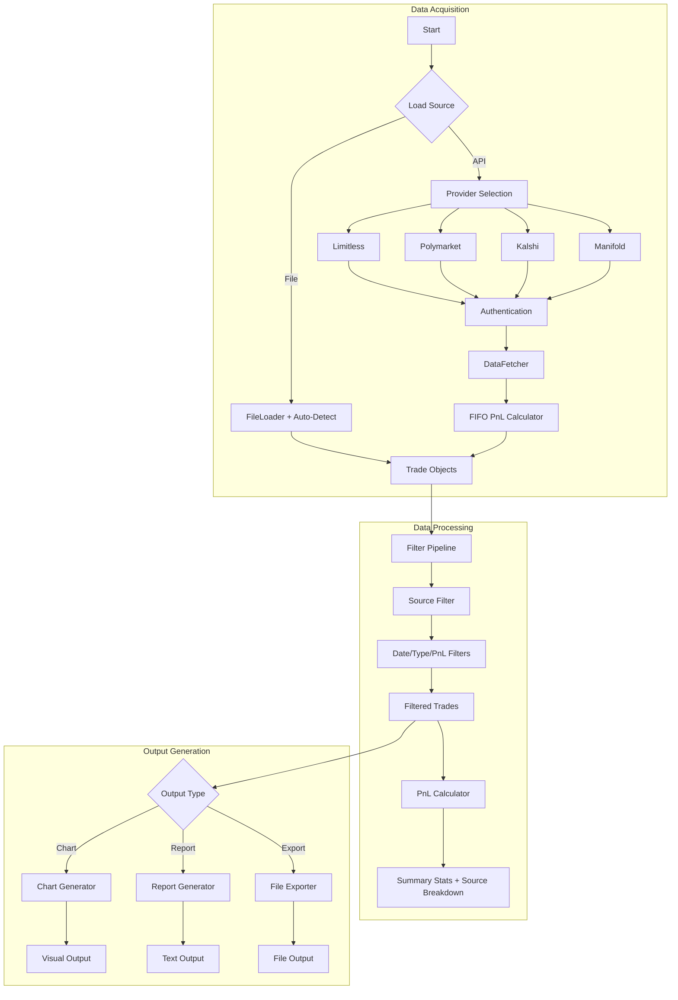
```mermaid
flowchart TB
    subgraph "Data Acquisition"
        A[Start] --> B{Load Source}
        B -->|File| C[FileLoader + Auto-Detect]
        B -->|API| D[Provider Selection]
        D --> D1[Limitless]
        D --> D2[Polymarket]
        D --> D3[Kalshi]
        D --> D4[Manifold]
        D1 --> E[Authentication]
        D2 --> E
        D3 --> E
        D4 --> E
        E --> F[DataFetcher]
        C --> G[Trade Objects]
        F --> FIFO[FIFO PnL Calculator]
        FIFO --> G
    end

    subgraph "Data Processing"
        G --> H[Filter Pipeline]
        H --> H1[Source Filter]
        H1 --> H2[Date/Type/PnL Filters]
        H2 --> I[Filtered Trades]
        I --> J[PnL Calculator]
        J --> K[Summary Stats + Source Breakdown]
    end

    subgraph "Output Generation"
        I --> L{Output Type}
        L -->|Chart| M[Chart Generator]
        L -->|Report| N[Report Generator]
        L -->|Export| O[File Exporter]
        M --> P[Visual Output]
        N --> Q[Text Output]
        O --> R[File Output]
    end
```

---

## Appendix: State Transition Triggers

### User Actions
| Trigger | Component | Transition |
|---------|-----------|------------|
| Select provider dropdown | GUI | NoDataLoaded -> ProviderSelected |
| Click "Load File" | GUI | NoDataLoaded -> FileLoading |
| Click "Load from API" | GUI | ProviderSelected -> APIFetching |
| Click "Apply Filters" | GUI | DataLoaded -> FiltersApplied |
| Click "Clear Filters" | GUI | FiltersApplied -> DataLoaded |
| Select menu option | CLI | CurrentMenu -> SelectedSubmenu |
| Call fetch_trades MCP tool | MCP | Ready -> Loading |

### System Events
| Event | Component | Transition |
|-------|-----------|------------|
| API key resolved | Auth | ResolvingKey -> KeyResolved |
| Provider detected from key | Provider | AutoDetecting -> ProviderKnown |
| Provider detected from file | Provider | CheckFileFormat -> ProviderKnown |
| No API key found | Auth | ResolvingKey -> NoKey |
| Last page fetched | DataFetch | CheckingMore -> Complete |
| File write success | Export | WritingFile -> Success |
| Session saved to SQLite | MCP | Persisting -> Ready |

### Data Events
| Event | Component | Transition |
|-------|-----------|------------|
| Trade processed | PnL | ProcessingTrade -> UpdatingCumulative |
| FIFO match found | PnL Calculator | IsSell -> CalculatePnL |
| All trades done | Chart | RecordingDataPoint -> BuildingFigure |
| Filter applied | Filter | Input -> Output (pure transform) |
| New source added | MCP Session | SingleSource -> MultiSource |
